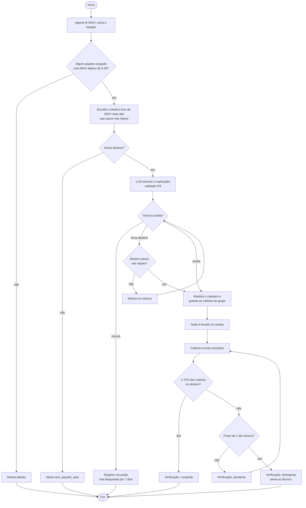

# 2 · Atividades: ciclo do manejo com verificação

```mermaid
flowchart TD
    A([Início]) --> B[Agente lê NDVI, clima e lotação]
    B --> C{Algum piquete ocupado<br/>com NDVI abaixo de 0,35?}
    C -- não --> Z1[Mostra alertas] --> F([Fim])
    C -- sim --> D[Escolhe o destino livre de NDVI mais alto<br/>que passa nas regras]
    D --> E{Achou destino?}
    E -- não --> Z2[Alerta sem_piquete_apto] --> F
    E -- sim --> G[LLM escreve a explicação<br/>validador R3]
    G --> H{Técnico aceita?}
    H -- recusa --> I[Registra recusada<br/>rota bloqueada por 7 dias] --> F
    H -- troca destino --> J{Destino passa<br/>nas regras?}
    J -- não --> K[Mostra os motivos] --> H
    J -- sim --> L
    H -- aceita --> L[Atualiza o cadastro e<br/>guarda as coleiras do grupo]
    L --> M[Gado é levado no campo]
    M --> N[Coleiras enviam posições]
    N --> O{≥ 75% das coleiras<br/>no destino?}
    O -- sim --> P[Verificação: cumprida] --> F
    O -- não --> Q{Prazo de 1 dia venceu?}
    Q -- não --> R[Verificação: pendente] --> N
    Q -- sim --> S[Verificação: divergente<br/>alerta ao técnico] --> F
```

Código: `agente.gerar_plano`, `servico.aceitar` / `recusar`, `verificacao.verificar`.
