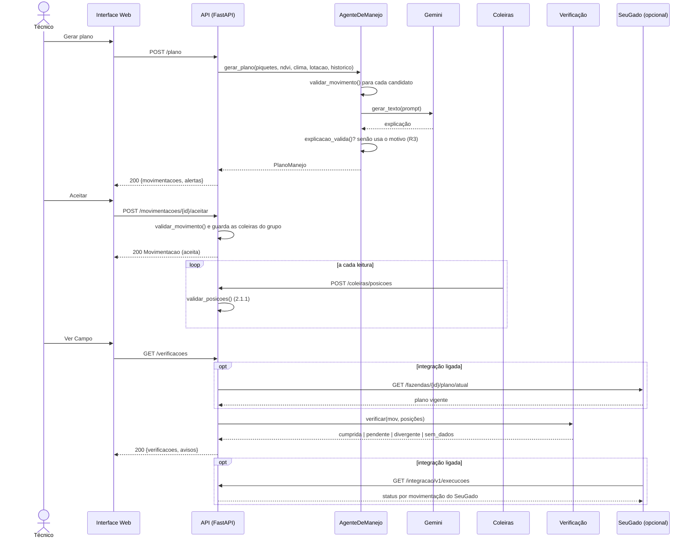

# 3 · Sequência

Evolução do diagrama dos módulos 3 e 4: entram a verificação pelas coleiras e o plano externo.

```mermaid
sequenceDiagram
    actor T as Técnico
    participant W as Interface Web
    participant A as API (FastAPI)
    participant AG as AgenteDeManejo
    participant L as Gemini
    participant C as Coleiras
    participant V as Verificação
    participant S as SeuGado (opcional)

    T->>W: Gerar plano
    W->>A: POST /plano
    A->>AG: gerar_plano(piquetes, ndvi, clima, lotacao, historico)
    AG->>AG: validar_movimento() para cada candidato
    AG->>L: gerar_texto(prompt)
    L-->>AG: explicação
    AG->>AG: explicacao_valida()? senão usa o motivo (R3)
    AG-->>A: PlanoManejo
    A-->>W: 200 {movimentacoes, alertas}

    T->>W: Aceitar
    W->>A: POST /movimentacoes/{id}/aceitar
    A->>A: validar_movimento() e guarda as coleiras do grupo
    A-->>W: 200 Movimentacao (aceita)

    loop a cada leitura
        C->>A: POST /coleiras/posicoes
        A->>A: validar_posicoes() (2.1.1)
    end

    T->>W: Ver Campo
    W->>A: GET /verificacoes
    opt integração ligada
        A->>S: GET /fazendas/{id}/plano/atual
        S-->>A: plano vigente
    end
    A->>V: verificar(mov, posições)
    V-->>A: cumprida | pendente | divergente | sem_dados
    A-->>W: 200 {verificacoes, avisos}

    opt integração ligada
        S->>A: GET /integracao/v1/execucoes
        A-->>S: status por movimentação do SeuGado
    end
```

Código: `backend/maneja/api.py`, `servico.py`, `agente.py`, `verificacao.py`.
