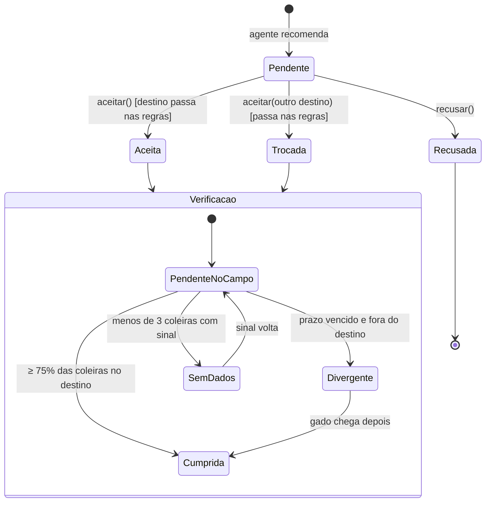
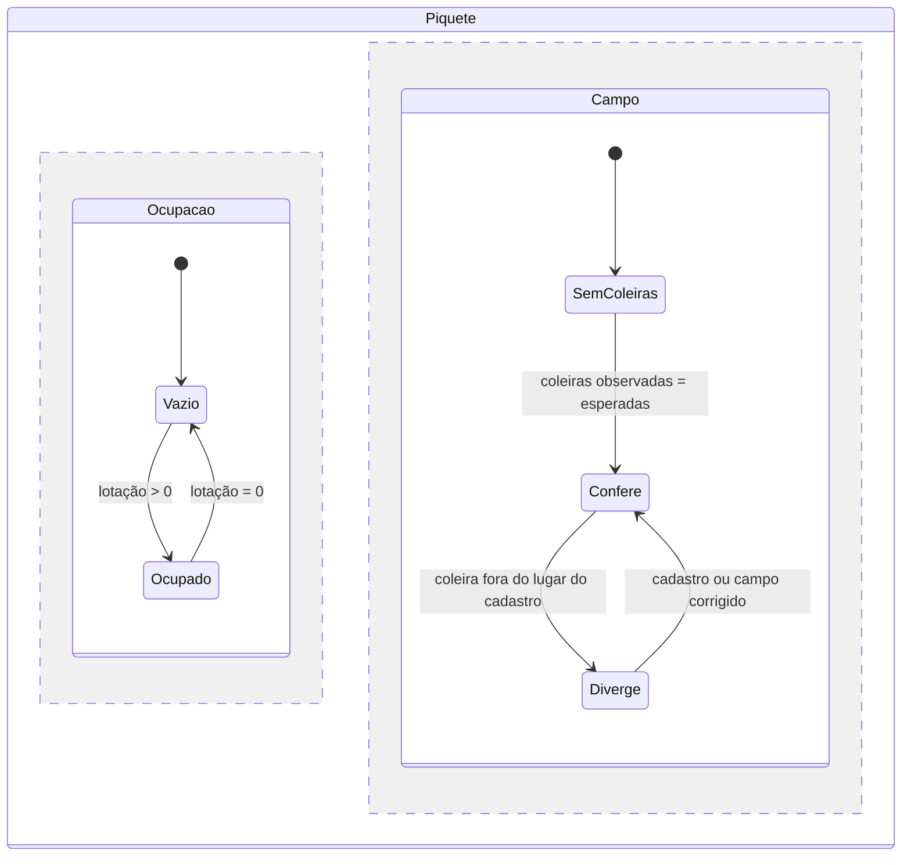

# 4 · Estados

## Movimentação

```mermaid
stateDiagram-v2
    [*] --> Pendente: agente recomenda
    Pendente --> Aceita: aceitar() [destino passa nas regras]
    Pendente --> Trocada: aceitar(outro destino) [passa nas regras]
    Pendente --> Recusada: recusar()
    Recusada --> [*]
    state Verificacao {
        [*] --> PendenteNoCampo
        PendenteNoCampo --> Cumprida: ≥ 75% das coleiras no destino
        PendenteNoCampo --> Divergente: prazo vencido e fora do destino
        PendenteNoCampo --> SemDados: menos de 3 coleiras com sinal
        SemDados --> PendenteNoCampo: sinal volta
        Divergente --> Cumprida: gado chega depois
    }
    Aceita --> Verificacao
    Trocada --> Verificacao
```

## Piquete: duas regiões concorrentes (como no módulo 4)

```mermaid
stateDiagram-v2
    state Piquete {
        state Ocupacao {
            [*] --> Vazio
            Vazio --> Ocupado: lotação > 0
            Ocupado --> Vazio: lotação = 0
        }
        --
        state Campo {
            [*] --> SemColeiras
            SemColeiras --> Confere: coleiras observadas = esperadas
            Confere --> Diverge: coleira fora do lugar do cadastro
            Diverge --> Confere: cadastro ou campo corrigido
        }
    }
```

Código: `dominio.StatusMovimentacao`, `dominio.StatusVerificacao`, `monitoramento.ocupacao`.
