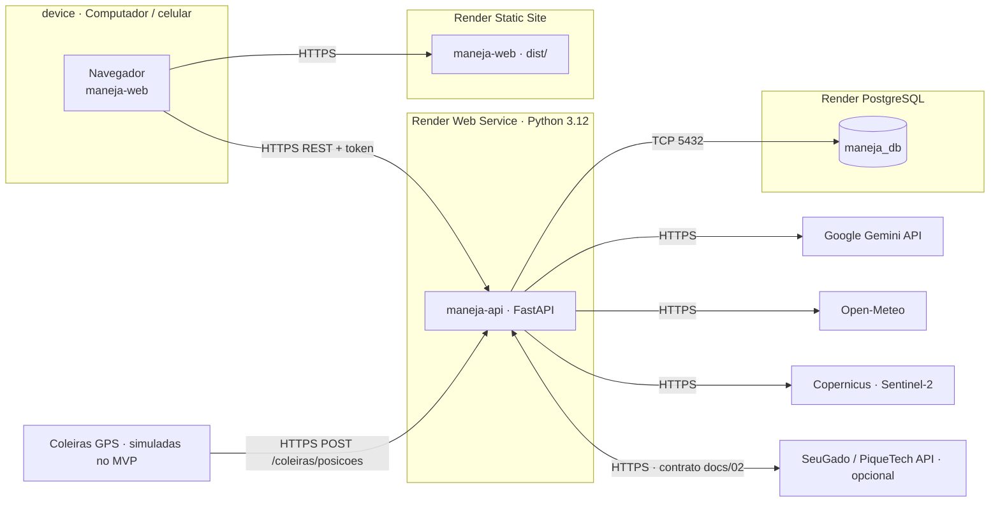

# 6 · Implantação

```mermaid
flowchart LR
    subgraph PC[device · Computador / celular]
        NAV[Navegador<br/>maneja-web]
    end
    subgraph R1[Render Static Site]
        WEBA[maneja-web · dist/]
    end
    subgraph R2[Render Web Service · Python 3.12]
        APIA[maneja-api · FastAPI]
    end
    subgraph R3[Render PostgreSQL]
        DB[(maneja_db)]
    end
    GEM[Google Gemini API]
    OM[Open-Meteo]
    CDSE[Copernicus · Sentinel-2]
    SEU[SeuGado / PiqueTech API · opcional]
    COLE[Coleiras GPS · simuladas no MVP]

    NAV -- HTTPS --> WEBA
    NAV -- HTTPS REST + token --> APIA
    APIA -- TCP 5432 --> DB
    APIA -- HTTPS --> GEM & OM & CDSE
    APIA <-->|HTTPS · contrato docs/02| SEU
    COLE -- HTTPS POST /coleiras/posicoes --> APIA
```

Código: `render.yaml` (SPEC-013), `backend/maneja/config.py`.
