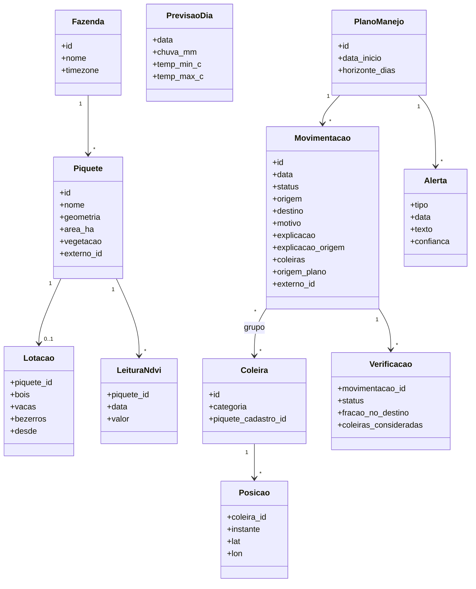

# 7 · Classes do domínio

```mermaid
classDiagram
    class Fazenda {
        +id
        +nome
        +timezone
    }
    class Piquete {
        +id
        +nome
        +geometria
        +area_ha
        +vegetacao
        +externo_id
    }
    class Lotacao {
        +piquete_id
        +bois
        +vacas
        +bezerros
        +desde
    }
    class LeituraNdvi {
        +piquete_id
        +data
        +valor
    }
    class PrevisaoDia {
        +data
        +chuva_mm
        +temp_min_c
        +temp_max_c
    }
    class Movimentacao {
        +id
        +data
        +status
        +origem
        +destino
        +motivo
        +explicacao
        +explicacao_origem
        +coleiras
        +origem_plano
        +externo_id
    }
    class Alerta {
        +tipo
        +data
        +texto
        +confianca
    }
    class PlanoManejo {
        +id
        +data_inicio
        +horizonte_dias
    }
    class Coleira {
        +id
        +categoria
        +piquete_cadastro_id
    }
    class Posicao {
        +coleira_id
        +instante
        +lat
        +lon
    }
    class Verificacao {
        +movimentacao_id
        +status
        +fracao_no_destino
        +coleiras_consideradas
    }

    Fazenda "1" --> "*" Piquete
    Piquete "1" --> "0..1" Lotacao
    Piquete "1" --> "*" LeituraNdvi
    PlanoManejo "1" --> "*" Movimentacao
    PlanoManejo "1" --> "*" Alerta
    Movimentacao "*" --> "*" Coleira : grupo
    Coleira "1" --> "*" Posicao
    Movimentacao "1" --> "*" Verificacao
```

Código: `backend/maneja/dominio.py` (igual a `src/lib/tipos.ts`).
